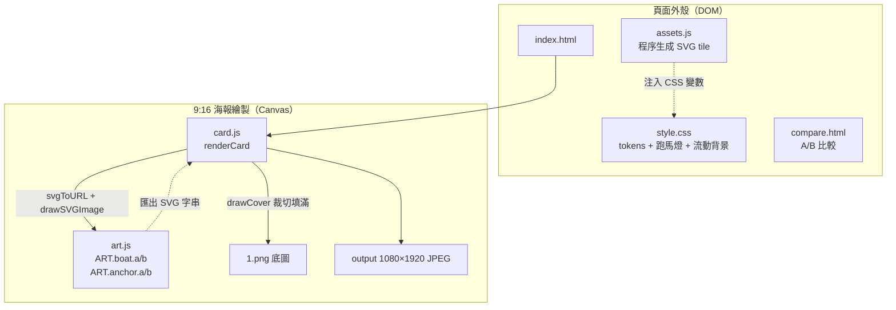
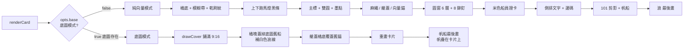
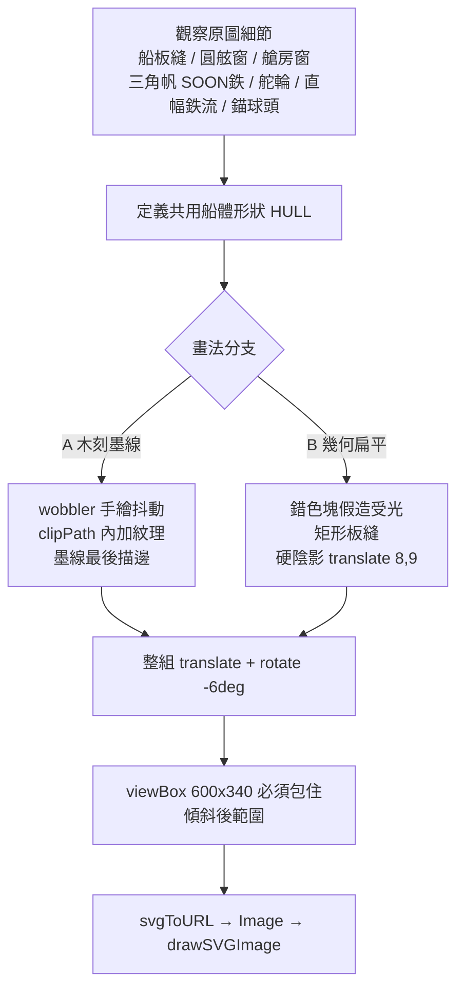
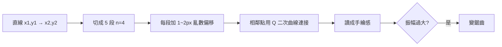
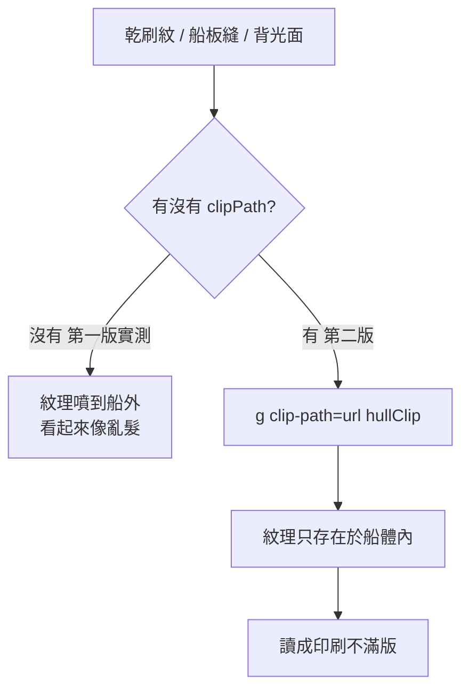
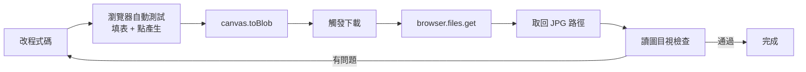
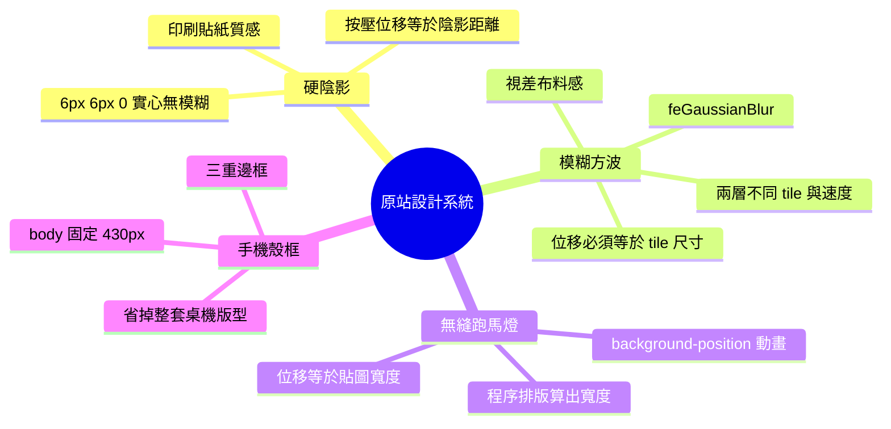
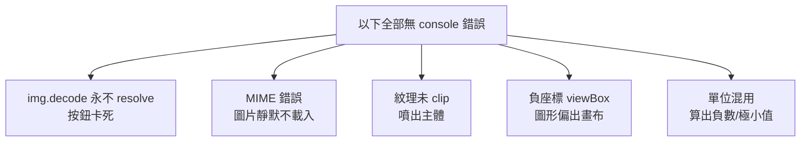

# 復刻 current.puma.taipei 視覺系統 — 工作紀錄

- **日期**：2026-10-05
- **專案路徑**：`D:\80-Opnecode\Projects\202610-puma-current-clone\`
- **目標網站**：`https://current.puma.taipei/id/`（台北大洋流 — 沈伯洋）
- **性質**：設計系統復刻教學示範，**非官方網站**

---

## 一、問題描述（使用者原始需求）

> 「我想要學習復刻這個網站，請示範如何做到無限逼近這個效果，最後結果類似這樣（附 9:16 海報圖）」

使用者提供參考圖，並在後續補充：

1. 提供底圖素材：`1.png`（768×1365）
2. 要求「把帆船/錨改成更細緻的向量插畫」
3. 要求「先目前這樣，用 MARKDOWN 與 MERMAID 格式紀錄，並 PUSH 到 REPO」

---

## 二、診斷過程與證據

### 2.1 先拆設計系統，而不是先拆畫面

抓取原站 `site.css` 與 `/id/` 頁面原始碼，實際讀到的 token：

```css
:root {
  --orange: #ea611d;   /* 主色 */
  --cream:  #f4efe6;   /* 紙感底 */
  --ink:    #15171c;   /* 文字 + 粗框 */
  --sea:    #03615a;
  --sand:   #ffe08a;
}
```

**診斷結論**：整站視覺複雜，但色彩只有 5 個、邊框只有 2 種粗細、陰影只有 1 種風格。

### 2.2 原站的 SVG 波浪背景實際寫法

`site.css` 內嵌兩層 data-URI SVG，核心是 `feGaussianBlur` 把方波邊界糊成正弦：

| 層 | tile 尺寸 | 模糊 stdDeviation | 動畫 | 位移 |
|---|---|---|---|---|
| 遠 | 520 × 1400 | 34 | 16s | `translate(-520px, -1400px)` |
| 近 | 780 × 2000 | 50 | 27s | `translate(-780px, -2000px)` |

**關鍵證據**：`@keyframes` 的位移值 == `background-size` 的 tile 尺寸。

### 2.3 跑馬燈條

```css
.bar {
  height: 34px;
  background: #000 url(/assets/stage/strip.svg) repeat-x left center / auto 100%;
  animation: marquee 17s linear infinite;
}
@keyframes marquee {
  from { background-position-x: 0; }
  to   { background-position-x: 594.2px; }   /* 非整數 */
}
```

**關鍵證據**：動畫位移 `594.2px` 必須等於貼圖 tile 的實際寬度。手動估整數會看到接縫跳動。

### 2.4 桌機處理策略

原站在 600px 以上**不做響應式重排**，而是把手機殼畫出來：

```css
@media (min-width: 600px) {
  html { background: #15171c; }
  body {
    width: 430px; max-width: 430px;
    box-shadow: 0 0 0 3px #000, 0 30px 80px rgba(0,0,0,.5);
  }
  .flag-bg { width: 430px; }
}
```

### 2.5 分享圖的產生方式

`/id/` 頁面引用 `/shared/crew-card.js` → `renderStory(card)`，輸出 canvas 後：

```js
lastBlob = await new Promise((r) => canvas.toBlob(r, "image/jpeg", 0.92));
lastUrl = URL.createObjectURL(lastBlob);
canShareFile = !!(navigator.canShare && navigator.canShare({ files: [cardFile()] }));
```

---

## 三、產出檔案

| 檔案 | 角色 |
|---|---|
| `style.css` | 設計 token + 頁面外殼（跑馬燈、流動背景、卡片、按鈕、A/B 切換列） |
| `assets.js` | **用數學生成 SVG**（跑馬燈條、波浪 tile、浪形符號） |
| `art.js` | 帆船 / 錨的兩種向量畫法（A 木刻墨線、B 幾何扁平） |
| `card.js` | Canvas 畫 1080×1920 的 9:16 海報，含底圖模式 |
| `index.html` | 表單 → 生成 → 預覽 → 下載/分享 + A/B 切換 |
| `compare.html` | A/B 插畫並排比較頁 |
| `_dev-server.js` | 本機靜態伺服器（:8899） |
| `1.png` | 使用者提供的底圖（768×1365） |

---

## 四、架構



---

## 五、渲染管線

### 5.1 兩種模式



**順序為何重要**

- **浪最後畫** → 蓋住船底，畫面才讀得出「船在水裡」
- **船在底圖模式最後畫** → 讓帆與旗幟疊在卡片上，與原圖前後關係一致

### 5.2 繪圖層級（純向量模式，由後到前）

```
1 橘底 + 白色模糊帶 + 深棕模糊帶      環境
2 乾刷紋理（固定種子亂數）            質感
3 上下黑條 + 白字跑馬燈              框架
4 主標「台北 大洋流」+ 雙圓 + 墨點     標題
5 麻繩 / 艙蓋 / 向量錨               裝飾
6 圓窗（6 層同心圓 + 8 顆鉚釘 + 玻璃反光）
7 米色船員證卡（姓名 / 艦隊）
8 側排文字 + 邊碼
9 101 剪影 + 帆船                    場景
10 浪
```

---

## 六、A/B 插畫比較

`compare.html` 為並排比較頁。兩版**造型相同、建構方式不同**。

| 面向 | **A 版 — 木刻墨線** | **B 版 — 幾何扁平** |
|---|---|---|
| 主導元素 | `stroke`（粗黑線） | `fill`（完全無描邊） |
| 線條 | 手繪抖動 | 筆直 |
| 立體感 | 墨線壓邊 | 錯色塊（暗橘 + 受光橘） |
| 質感 | 乾刷紋（夾在船體內） | 無紋理 |
| 船板縫 | 抖動曲線 | 細長矩形（工業製圖感） |
| 舵輪 | 8 輻 | 正交 4 輻 |
| 錨 | 描邊 + 球頭 | 單一封閉形 + 硬陰影 |

**A 版更貼近原站**，因原圖明顯為「粗黑線 + 印刷不滿版」的木刻感。

### 6.1 整體建構流程



### 6.2 手繪抖動的原理



### 6.3 為什麼裝飾必須 clip



---

## 七、根因分析

### 7.1 已驗證的根因（有實測證據）

| # | 根因 | 證據 |
|---|---|---|
| R1 | 靜態伺服器 MIME 缺 `.png` | `curl -w %{content_type}` 回傳 `application/octet-stream`；瀏覽器 `` 直接拒絕載入 |
| R2 | 各零件使用獨立絕對座標 | 帆、艙房、板縫互相對不齊，實測截圖確認 |
| R3 | 紋理未夾在主體形狀內 | 乾刷紋噴出船體輪廓，實測截圖確認 |
| R4 | 負座標圖形的 viewBox 配置錯誤 | 錨只露出一角，實測截圖確認 |
| R5 | 座標雙系統混用 | `h` 為輸出座標、扣除量卻用底圖單位 → 欄位高度算出 50px、文字疊字 |
| R6 | `img.decode()` 對已完成載入的圖片可能永不 resolve | 按鈕卡在「領取中…」，state 停在 `loading` |

### 7.2 推測但未證實

| # | 推測 | 狀態 |
|---|---|---|
| H1 | 原站帆船是 Figma 多段曲線匯出而非手工 path | 未取得原始設計檔，無法證實 |
| H2 | 原站乾刷紋是印刷網點而非隨機線段 | 僅憑像素觀察推測 |

---

## 八、處理動作與驗證結果

| # | 問題 | 處理 | 驗證 |
|---|---|---|---|
| 1 | `img.decode()` 卡死 | 改用 `img.complete` 判斷，未完成才 `await onload` | `frame.dataset.state` 由 `loading` → `ready`，按鈕恢復「領取船員證」 |
| 2 | Canvas 畫 `⚓` 變豆腐框 | 改用 `moveTo` / `quadraticCurveTo` 畫向量錨 | 截圖確認錨正常呈現 |
| 3 | `rotate(+90°)` 後多行直排疊回主體 | 偏移改用**負值** | 截圖確認右側直排文字離開卡片 |
| 4 | 單條 path 串接遞減矩形 → 鋸齒亂三角形 | 改為逐段 `fillRect` | 截圖確認 101 剪影正常 |
| 5 | 卡片高 410 < 欄位總高 546 | 卡片高改 560 | 截圖確認框線不再穿出 |
| 6 | 文字位置寫死數字，換字型就錯位 | 用 `ctx.measureText().width` 計算 | 標題雙圓自動對齊 |
| 7 | 底圖不出現 | 補齊 `_dev-server.js` 的 TYPES | `curl` 回傳 `200 image/png`，底圖正常顯示 |
| 8 | 各零件座標不對齊 | 共用座標系 + 整組 `translate/rotate` | 截圖確認船體各部件連貫 |
| 9 | 紋理噴出船外 | 加入 `<clipPath>` | 截圖確認紋理只在船內 |
| 10 | 錨偏出畫布 | viewBox 外包 `translate(100,132)` | 截圖確認錨完整 |
| 11 | 欄位扁掉、文字疊字 | 欄位高度由卡片可用高度反推 | 截圖確認兩欄位正常 |
| 12 | B 版錨爪太鈍（半圓） | 外弧下沉 + 內弧上收的「香蕉」形 | 截圖確認爪形銳利 |

### 驗證方式



---

## 九、A/B 實測驗證

直接比對兩版輸出大小（避免 UI 時序干擾）：

```
A=584071  B=576039  相同=false
```

代表兩版確實產出不同圖檔，非快取誤判。

---

## 十、這一章的教學價值

### 10.1 四大核心技巧



### 10.2 五個無聲失敗（沒有報錯但結果全錯）



---

## 十一、改善對策

### 立即

- [x] `img.complete` 取代 `decode()`
- [x] 靜態伺服器 MIME 列齊
- [x] 裝飾加 `clipPath`
- [x] 欄位高度改為反推

### 短期

- [ ] 把 `1.png` 的文字區域（標題、湖湖/大洪流、2099.12.32）參數化，改由 Canvas 動態繪製
- [ ] 修正帆船右緣裁切（目前 `鉄流` 直幅貼近邊界）
- [ ] 遮罩橘塊左緣的橘/米色硬邊需對齊底圖浪線
- [ ] 讓 A/B 切換在「未產生過」時也能即時預覽

### 中期

- [ ] 接上大頭貼上傳（原站做法：裁正方形 → 縮至 640px → 輸出 96px / 480px 兩份）
- [ ] LINE OAuth + 後端發卡
- [ ] 補上其他頁面（`/ar/`、`/bottle/`、`/map/`、`/route/`）驗證 token 複用
- [ ] 字型不足時以 `-webkit-text-stroke` 補重

---

## 十二、執行方式

```powershell
node _dev-server.js        # http://127.0.0.1:8899
```

> **注意**：此機器 `HTTP_PROXY` 會攔截 `localhost`。測試時用
> `curl.exe --noproxy '*' http://127.0.0.1:8899/`，瀏覽器不受影響。

---

## 十三、附錄

### 診斷指令

```powershell
# 驗證 dev server 的 MIME
curl.exe -s -o NUL -w "%{http_code} %{content_type}" --noproxy '*' http://127.0.0.1:8899/1.png

# 確認 A/B 兩版確實不同（繞開 UI 時序）
curl / 瀏覽器內直接 import card.js 比較 toDataURL().length
```

### 設計 token 出處

| Token | 值 | 出處 |
|---|---|---|
| `--orange` | `#ea611d` | 原站 `site.css` `:root` |
| `--cream` | `#f4efe6` | 同上 |
| `--ink` | `#15171c` | 同上 |
| `--sea` | `#03615a` | 同上 |
| `--sand` | `#ffe08a` | 同上 |

### 座標雙系統對照

| 用途 | 單位 | 轉換 |
|---|---|---|
| 底圖 `1.png` | 768 × 1365 | — |
| 輸出海報 | 1080 × 1920 | — |
| 底圖模式 `U(v)` | — | `v * 1080 / 768` |
| 純向量模式 `px(v)` | — | `v * SCALE` |

**陷阱**：`h` 已經換算成輸出座標，所有扣除量也必須是輸出座標。混用底圖單位會算出負數或極小值。